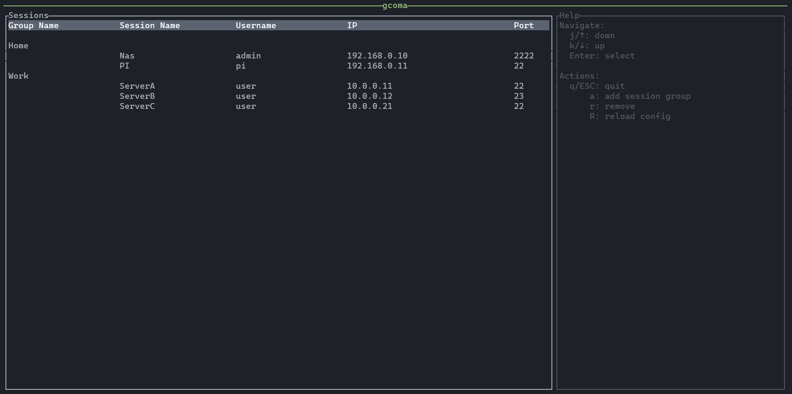

# gcoma

**gcoma** or **G**eri's **Co**nnection **Ma**nager is a small project, that I started to learn rust.

The goal of this project is to create a MTPuTTY like cli app, where you can easily store/group all your telnet and ssh sessions.

If you find anything that isn't rusty enough feel free to correct me. :)

## Args
```
USAGE:
    gcoma [OPTIONS] --user-config <USER_CONFIG>

OPTIONS:
    -c, --connect <SESSION_INDEX>        Connect to session by index
    -h, --help                           Print help information
    -l, --list                           List all sessions
    -r, --remove <SESSION_GROUP_NAME>    Remove session group by name
    -u, --user-config <USER_CONFIG>      Path to user config file
    -V, --version                        Print version information
```

## Screenshot



## License
This project is licensed under the Apache License 2.0 - see the [Apache License 2.0](LICENSE) file for details.
